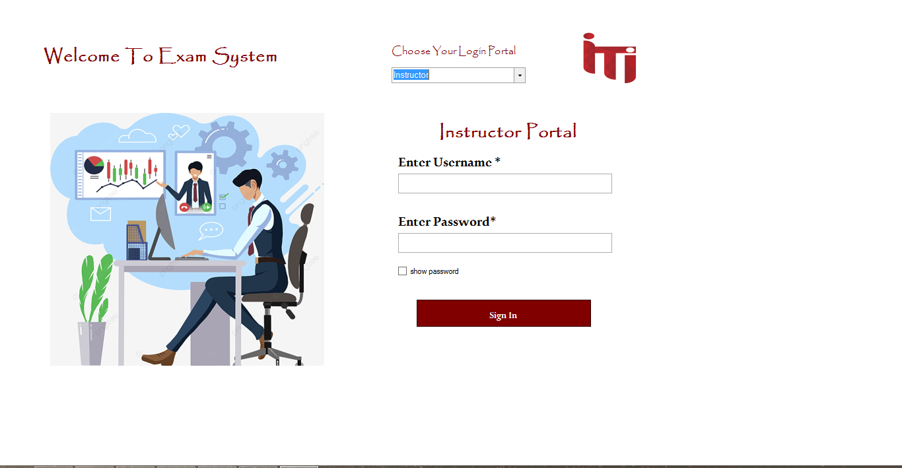
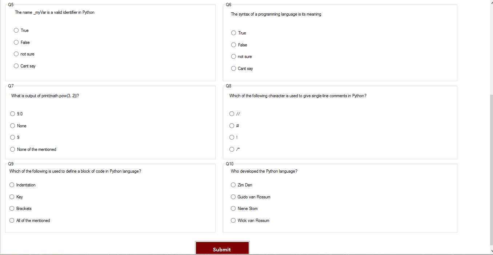
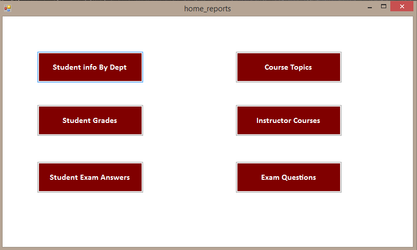

# Examination-System

### Overview

A desktop application to facilitate examination process in educational organization Where student can register their information and then choose subject to start MCQ exam generated randomly from question bank. After finishing exam student submit their answers and result is shown to student immediately as exam is corrected automatically

### Steps

designed ERD for the system by identifying entities , attributes  and their relations then logical design and physical design in SQL server

built desktop GUI using windows forms to facilitate CRUD operations

created multiple stored procedures to facilitate CRUD operations in addition to some stored proc that generate exam randomly based on some parameters and Correct exam answers and return the grade to student

Developed SSRS reports that provides information on :
- students information according to Department No parameter.
- grades of the student in all courses based on student ID
- courses that instructors teaches and the number of students per course based on instructor ID
- topics covered in course based on course ID
- questions in  the exam with student answers based on exam ID and student ID

built interactive dashboard using power bi to visualize data and help managerial level discover insights related to system

### Technologies Used

- SQL Server
- C#
- Windows Form
- Power BI
- SSIS
- SSRS

